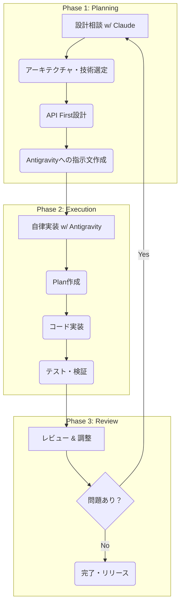

# 【AIネイティブ開発】Claude × Antigravityで実現する「設計から実装まで」の共創フロー

個人開発において、AIはもはや「コード補完」だけの存在ではありません。
私は現在、**Claude**を設計パートナーに、**Antigravity**（Google Deepmindチーム開発のAgentic Coding Agent）を実装パートナーに迎え、Reactライブラリ `react-manga-effects` を開発しています。

本記事では、**「Claudeと設計を練り、Antigravityが自律的に実装する」** という次世代の共創開発フローを紹介します。

## プロジェクト概要

`react-manga-effects` は、漫画的な集中線（SpeedLines）やアイリスワイプ（IrisWipe）をReactコンポーネントとして提供するライブラリです。

:::note info
**ポイント**
このプロジェクトは「人間がコードを書く」のではなく、**「AIと対話して設計し、AIが実装する」** ことを前提に進めました。
:::

## 開発フロー全体像



## なぜこのツール選定なのか（Q&A）

読者の皆さんは「最初からAntigravityで設計すればいいのでは？」「他のCoding Agentでいいのでは？」と思われるかもしれません。率直な選定理由は以下の通りです。

### Q1. なぜ設計はClaudeなのか？

**A. 「思考の壁打ち相手」として、個人的にClaudeが最も話しやすいと感じているからです。**

Antigravityも対話は可能ですが、どちらかと言えば「実装タスクの遂行」が得意な印象です。
一方、Claudeは「何を作るか」という抽象的な議論や、こちらの意図を汲み取って整理する能力が高いと感じています。
「思考（Head）」はClaude、「手足（Hands）」はAntigravity、と役割を分けることで、それぞれの強みを活かせた実感があります。

### Q2. なぜ実装はAntigravityなのか？

**A. Google Deepmind発の新しいAgenticワークフローを試してみたかったからです。**

CursorやGensparkなど多くの選択肢がありますが、Antigravityの **「Plan（計画）→ Execute（実行）→ Verify（検証）」** という自律ループが、今回の「丸投げ開発」のコンセプトにフィットしそうだと感じました。

**Agenticループの効果（実感値）:**
- **コンテキストスイッチの削減**: 「Plan」で方針を決めたら一気に走ってくれるため、人間が細切れに指示を出す頻度が減った気がします。
- **自己修復能力**: 「Verify」でエラーが出ても、自律的にログを読んで修正してくれる場面が多く、介入の手間が省けました。

### Q3. AI任せでコード品質は大丈夫？

**A. 「AI_GUIDELINES.md」と「人間のレビュー」で担保しています。**

プロジェクト独自のガイドライン（AI_GUIDELINES.md）を読み込ませることで、命名規則やディレクトリ構造を徹底させています。
また、最終的なマージ権限は人間が持っているため、変なコードがあればPhase 3で弾きます。「AIが書いたコード」ではなく「AIと一緒に育てたコード」という感覚です。

### Q4. どれくらい時短になった？

**A. 「手を動かす時間」が大幅に減った実感があります。**

Canvas APIの細かい仕様調査や、大量のボイラープレートコード記述といった「実装の泥臭い部分」をAgentにある程度任せられるため、人間は「設計」と「レビュー」に集中しやすくなります。
「時間の短縮」以上に、「メインのロジックや使い勝手の追求に脳のリソースを割ける」ことがメリットだと感じました。

## Phase 1: Claudeとの設計相談

### なぜ「設計」をClaudeに相談するのか

Antigravityは優秀な実装者ですが、「そもそも何を作るべきか」「どういう設計が良いか」を一緒に議論するには、対話型のClaudeが向いています。

私がClaudeに相談した内容：

1. **技術選定の相談**
   - 「Viteとrollup、ライブラリ開発にはどっちがいい？」
   - 「SpeedLinesはCanvasとCSSどっちで実装すべき？」

2. **API Firstの型設計**
   - 「IrisWipeのPropsはどういう設計がいい？」
   - 「イージング関数はプリセット？カスタム関数？両対応？」

3. **Antigravityへの指示文作成**
   - 「この設計でAntigravityに実装させたい。指示文を作って」

### 実際の設計相談例

例えば、SpeedLinesの実装方針について：

:::note info
**SpeedLinesの技術選定プロセス**

**私**: 「SpeedLinesコンポーネント、CSSとCanvasどっちがいい？」

**Claude**: 
> 60本以上の線を60fpsでアニメーションさせるなら**Canvas + requestAnimationFrame**がベスト。
> CSSだと大量のDOM要素でパフォーマンス劣化の懸念がある。
> 静的表示だけならCSSでもいいけど、将来的な拡張性を考えるとCanvas推奨。

このやり取りで「Canvas採用」が決まり、その方針をAntigravityへの指示に含めました。
:::

### API First: 型定義を先に固める

実装に入る前に、Claudeと一緒に「使い心地」を確定させました。

```typescript:src/types/index.ts
// Claudeと議論して決めたIrisWipeのインターフェース
export interface IrisWipeProps {
    /** The content to be revealed/hidden */
    children: React.ReactNode;
    /** Controls the open/close state of the iris. True for open, False for closed. */
    isOpen: boolean;
    /** Center point of the iris (0-100 percentage). Default: { x: 50, y: 50 } */
    center?: Point;
    /** Animation duration in milliseconds. Default: 500 */
    duration?: number;
    /** Easing function or preset name for the animation. Default: 'easeInOut' */
    easing?: EasingPreset | EasingFunction;
    /** Callback fired when animation completes */
    onComplete?: () => void;
}
```

この型定義をAntigravityに渡すことで、「作ってもらったけど使いにくい」という手戻りを防いでいます。

### 指示文の作成

設計が固まったら、Claudeに「Antigravityへの指示文」を作ってもらいます。

**私**: 「この設計でAntigravityに実装させたい。指示文を作って」

**Claude**: （Markdown形式の詳細な指示文を生成）

指示文には以下を含めます：
- 作成するファイル一覧
- 各コンポーネントの実装方針
- 検証手順（npm run build, Storybook確認など）

## Phase 2: Antigravityによる自律実装

### Agentic Modeの威力

Claudeから受け取った指示文をAntigravityに渡すと、以下を**自律的に**実行します：

1. **Plan作成**: 指示文から実装計画を立てる
2. **ファイル作成**: `src/components/IrisWipe/IrisWipe.tsx` など
3. **コード実装**: TypeScript, CSS, Storybookストーリー
4. **検証**: `npm run build`, `npm test`, Storybook起動

私の役割は「Planを承認する」「成果物をレビューする」だけ。

### Agentic Modeが生む「余白」

従来のチャットAIだと「コードを書いて」→「エラー出たよ」→「修正して」という**ラリー（往復）**が発生し、人間はその間待機している必要がありました。
しかしAgentic Modeでは、**「Plan承認」から「Verify完了」までAntigravityがノンストップで走ります。**

この間、私は別のタスク（ドキュメント整備や、Claudeとの次機能の相談）を進めることができます。
単なる自動化以上に、**「開発者の脳の並列処理」** を可能にする点が、Agentic Workflowの真価だと感じています。

### 実際の作業風景

Antigravityに指示文を渡すと、まずPlanが表示されます：

```text
Proposed Changes:
- [NEW] src/components/IrisWipe/IrisWipe.tsx
- [NEW] src/components/IrisWipe/IrisWipe.css
- [NEW] src/components/IrisWipe/IrisWipe.stories.tsx

Verification Plan:
- Run `npm run build` to verify compilation
- Run `npm test` to verify tests pass
- Start Storybook to visually verify component
```

「OK」と返すだけで、あとはAntigravityが黙々と作業を進めます。

### 問題発生時のフロー

実装中に問題が起きたら、**Claudeに相談**して解決策を練り、**Antigravityに追加指示**を出します。

:::note warning
**トラブルシューティング例**

SpeedLinesが「漫画の集中線」ではなく「ズームエフェクト」になってしまった時：

1. **私→Claude**: 「SpeedLinesが外向きに動くズームになってる。漫画の集中線は内向きで静止してるはず」
2. **Claude**: 「確かに。線を内側に向けて、デフォルトは静止、アニメーションはオプションにすべき。修正指示文を作るね」
3. **私→Antigravity**: （Claudeが作った修正指示文を渡す）
4. **Antigravity**: 修正実装 → 検証 → 完了
:::

## Phase 3: npm公開とCI/CD

### 公開準備もClaudeと相談

「npm公開したいけど何が必要？」とClaudeに聞くと：

- package.jsonに必要なフィールド（keywords, repository, homepage等）
- .npmignoreで除外すべきファイル
- exports設定（ESM/CJS両対応）
- `npm pack --dry-run` での確認方法

これらを指示文にまとめてAntigravityに渡し、公開準備を完了。

### GitHub Actionsの自動化

CI/CDの設定もClaudeに相談：

**私**: 「タグをpushしたら自動でnpm公開したい」

**Claude**: （publish.ymlとci.ymlの内容を提案）

Antigravityがワークフローファイルを作成し、あとは `git tag v0.1.0 && git push --tags` するだけで自動公開される仕組みが完成。

### 遭遇したトラブルと解決（これが重要）

もちろん、最初からすべてスムーズに行ったわけではありません。特にGitHub ActionsからのNPM公開周りで詰まりました。

1. **エラー発生**: `npm publish` が権限エラーで失敗。
2. **原因特定**: AIにエラーログを読ませると、「これはTrusted Publishingの設定不足か、パッケージ名のScope不一致です」と指摘。
3. **解決**: AIの提案通り `.github` のワークフローに `permissions: id-token: write` を追加し、OIDC(OpenID Connect)による認証を有効化。あわせて `package.json` の `name` スコープも修正。

本来、最新の「Trusted Publishing」を使えばトークン（鍵）は不要なはずですが、OIDC連携のための `id-token: write` 権限が漏れていると認証に失敗します。
この複雑なCI/CDエラーも、AIにログを読ませることで「権限設定が足りないですね」とスムーズに原因を指摘してくれました。

## こだわりポイント

### 1. Storybookを「共通言語」に

UIコンポーネントの見た目を言葉だけで伝えるのは困難です。Storybookを導入することで：

- **人間**: ブラウザで視覚的に確認
- **Antigravity**: Storybookのストーリー設定を理解して操作
- **Claude**: Storybookの構成について議論

Storybookが「仕様書」として機能しています。

### 2. 役割分担の明確化

| 役割 | 担当 |
|------|------|
| 設計相談・技術選定 | Claude |
| API設計（型定義） | Claude + 人間 |
| 指示文作成 | Claude |
| 自律実装・検証 | Antigravity |
| 承認・最終レビュー | 人間 |

この分担により、人間は「考える」ことに集中し、「作業」はAIに任せられます。

### 3. 指示文というインターフェース

Claudeが作る「指示文」が、設計意図を実装に正確に伝えるインターフェースになっています。

:::note info
**指示文の効果**
曖昧な口頭指示ではなく、構造化された指示文を介することで：
- 意図のブレが減る
- 再現性がある（同じ指示で同じ結果）
- 履歴として残る
:::

## おわりに

### この記事の作成プロセス

### この記事の作成プロセス（ドキュメンタリー）

この記事自体も、以下のような「AIと人間のキャッチボール」を経て完成しました。

1. **Antigravity**: プロジェクトファクトを元に初稿を作成（機能紹介中心）
2. **私**: 「もっとエージェントの自律性を強調して」とリクエスト
3. **Antigravity**: Agentic Modeの解説を拡充した第2稿を作成
4. **私→Claude**: 「全体的にAntigravity推しすぎる。Claudeとの共創フローにして」
5. **Claude**: 構成を「設計(Claude) vs 実装(Antigravity)」の対比構造にリライト
6. **Antigravity**: リライト案を適用しつつ、技術的な裏付け（Canvas使用有無など）を検証
7. **私**: 「言い切りが強すぎる。もっと個人の主観ベースのトーンに直して」
8. **Antigravity**: 「優秀です」→「優秀だと感じました」等へトーンを調整して完成

**作成工数の9割はAI**が担っていますが、**記事の魂（方向性や熱量）を入れたのは人間**という、まさにこのプロジェクトを象徴するプロセスでした。

### AIを「使う」から、AIと「働く」へ

このプロジェクトを通じて実感したのは：

- **Claude**: 優秀な設計パートナー・相談相手
- **Antigravity**: 優秀な実装者・作業者

という役割分担の有効性です。

人間の役割は「コードを書くこと」から「AIと対話し、方向性を決め、成果物をレビューすること」にシフトしています。

`react-manga-effects` は、そんな「未来の開発体験」を先取りした実験場です。
皆さんもぜひ、AIエージェントとの「役割分担」を意識した開発フローを試してみてください。

---

## リンク

- **GitHub**: https://github.com/erutobusiness/react-manga-effects
- **npm**: https://www.npmjs.com/package/react-manga-effects