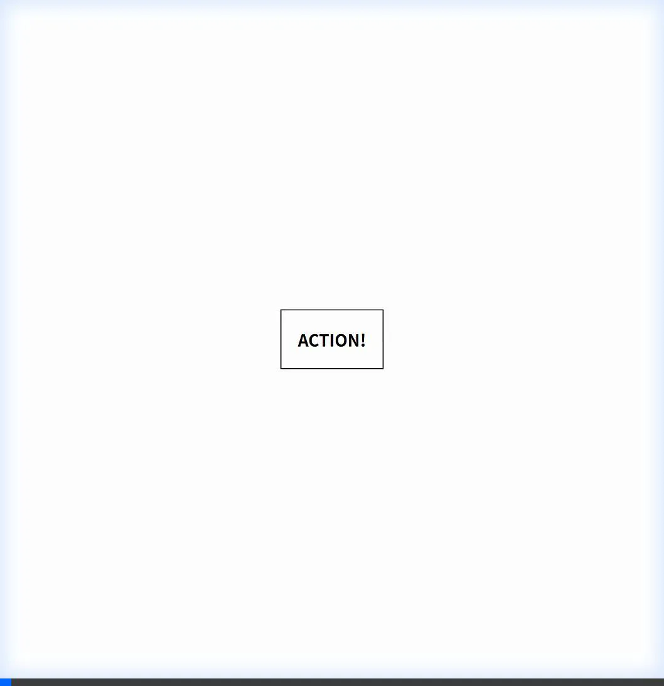

# 🎬 react-manga-effects

> Add dramatic anime/manga impact effects to your React applications with zero fuss.


**react-manga-effects** provides lightweight, customizable high-impact visual effects common in anime and manga, such as circular iris wipes and dynamic focus lines. Built with TypeScript and optimizing for performance.

## Demo



## Features

- **🌀 IrisWipe**: Classic anime-style circular transition to open/close scenes.
- **⚡ SpeedLines**: Dynamic focus/concentration lines (motion lines) to emphasize action or shock.
- **📘 TypeScript Support**: Fully typed props and exports.
- **🎈 Lightweight**: Zero runtime dependencies (other than React).
- **🚀 SSR Compatible**: Works with Next.js, Remix, and Gatsby.
- **🎨 Highly Customizable**: Control colors, density, speed, easing, and positioning.

## Installation

```bash
npm install @erutobusiness/react-manga-effects
# or
yarn add @erutobusiness/react-manga-effects
# or
pnpm add @erutobusiness/react-manga-effects
```

## Quick Start

Import the components and use them in your React app:

```tsx
import React, { useState } from 'react';
import { IrisWipe, SpeedLines } from '@erutobusiness/react-manga-effects';

const App = () => {
    const [isOpen, setIsOpen] = useState(true);

    return (
        <div style={{ width: '100vw', height: '100vh', position: 'relative' }}>
            {/* Background Content */}
            

            {/* Overlay Effects */}
            <SpeedLines 
                animated 
                color="rgba(0,0,0,0.5)" 
                center={{ x: 50, y: 50 }} 
            />

            <IrisWipe 
                isOpen={isOpen} 
                duration={1000} 
                center={{ x: 50, y: 50 }}
                onComplete={() => console.log('Transition Complete')}
            >
                {/* Content to be revealed/hidden inside the wipe can go here if needed, 
                    typically IrisWipe is used as an overlay. */}
            </IrisWipe>
            
            <button 
                onClick={() => setIsOpen(!isOpen)}
                style={{ position: 'absolute', bottom: 20, left: 20, zIndex: 100 }}
            >
                Toggle Transition
            </button>
        </div>
    );
};

export default App;
```

## Components API

### IrisWipe

A circular masking transition effect.

| Prop | Type | Default | Description |
|------|------|---------|-------------|
| `isOpen` | `boolean` | **Required** | `true` to reveal content (open iris), `false` to hide (close iris). |
| `duration` | `number` | `500` | Animation duration in milliseconds. |
| `center` | `{ x: number, y: number }` | `{ x: 50, y: 50 }` | Center point of the iris in percentage (0-100). |
| `easing` | `string` | `'easeInOut'` | CSS transition timing function (e.g., `'linear'`, `'ease-out'`, `'cubic-bezier(...)`'). |
| `onComplete` | `() => void` | `undefined` | Callback function fired when the transition finishes. |
| `className` | `string` | `''` | Additional CSS classes for the container. |
| `style` | `CSSProperties` | `{}` | Inline styles for the container. |

#### Example: Custom Center
```tsx
<IrisWipe 
  isOpen={show} 
  center={{ x: 80, y: 20 }} // Focus on top-right
  duration={1200}
/>
```

### SpeedLines

Concentration lines typically used to show speed, shock, or intense focus.

| Prop | Type | Default | Description |
|------|------|---------|-------------|
| `lineCount` | `number` | `60` | Number of lines to draw. Higher values create a denser effect. |
| `color` | `string` | `'rgba(0, 0, 0, 0.6)'` | Color of the lines. Supports valid CSS colors. |
| `minLength` | `number` | `10` | Minimum length of lines as a percentage of the container size. |
| `maxLength` | `number` | `30` | Maximum length of lines as a percentage of the container size. |
| `innerRadius` | `number` | `0` | Radius of the empty safe zone in the center (percentage). |
| `center` | `{ x: number, y: number }` | `{ x: 50, y: 50 }` | The convergence point of the lines. |
| `animated` | `boolean` | `false` | If `true`, lines will animate (opacity pulse/shake). |
| `animationSpeed`| `number` | `1` | Speed multiplier for the animation. |
| `className` | `string` | `''` | Additional CSS classes. |
| `style` | `CSSProperties` | `{}` | Inline styles. |

#### Example: Intense Action
```tsx
<SpeedLines 
  lineCount={120} 
  color="red" 
  innerRadius={10} 
  animated={true}
  animationSpeed={1.5}
/>
```

## Storybook

We use Storybook for development and testing.

1. Clone the repository
2. Install dependencies: `npm install`
3. Run Storybook:
   ```bash
   npm run storybook
   ```
4. Open [http://localhost:6006](http://localhost:6006) to view the components.

## Development

Contributions are welcome!

1. Clone the repo:
   ```bash
   git clone https://github.com/erutobusiness/react-manga-effects.git
   cd react-manga-effects
   ```

2. Install dependencies:
   ```bash
   npm install
   ```

3. Start development server (Storybook):
   ```bash
   npm run storybook
   ```

## License

MIT © [erutobusiness](https://github.com/erutobusiness)